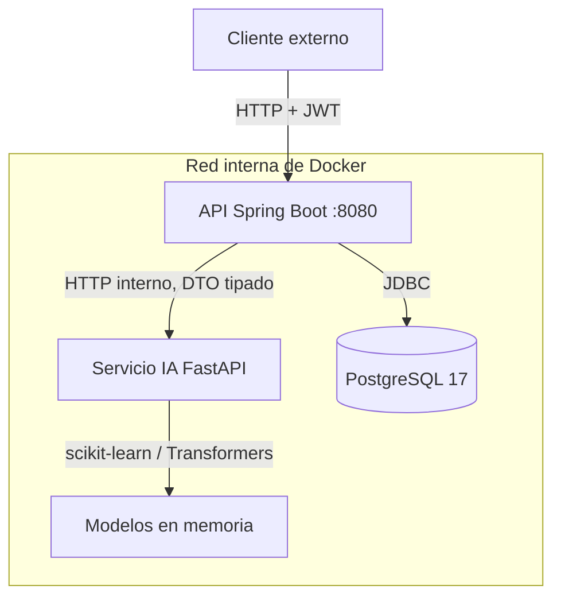

# Microservicio Inteligente

API en Java (Spring Boot) que recibe datos de usuarios y delega la
inferencia a un servicio Python con modelos de scikit-learn.



Solo la API Java publica puertos. El servicio de IA vive en la red interna
de Docker y no es alcanzable desde fuera: no es una medida de estilo, es la
razón de que un fallo de inferencia no pueda convertirse en superficie de
ataque.

```
microservicio/
├── ia-python/            Servicio de IA (interno, no expuesto)
│   ├── dataset_fraude.py Descarga y carga el dataset real de OpenML
│   ├── entrenamiento.py  Genera y guarda el modelo de fraude
│   ├── motor_sentimiento.py Transformer + respaldo, con degradación
│   ├── main.py             FastAPI: carga modelos, expone /predict/*
│   ├── comparar_modelos.py Compara TF-IDF vs transformer, y decide
│   ├── test_modelos.py      Tests del contrato y del orden de columnas
│   ├── test_motor.py        Tests del motor y de la degradación
│   ├── test_endpoint_fraude.py  Tests del umbral frente a la respuesta
│   ├── prueba_carga.py          Carga, saturación y caída de la IA
│   ├── comparar_datasets.py     ¿Aportan los datos sintéticos?
│   ├── evaluar_features.py      ¿Ayudan las variables derivadas? (no)
│   ├── requirements.txt    Versiones fijadas
│   ├── datos/            Dataset descargado (144 MB, NO versionado)
│   ├── modelos/            .joblib generados (5 MB, NO versionados)
│   ├── Dockerfile
│   └── .dockerignore
├── api-java/             API publica (:8080)
│   ├── pom.xml
│   ├── Dockerfile
│   ├── .dockerignore
│   └── src/main/
│       ├── java/com/ejemplo/microservicio/
│       │   ├── controller/   Endpoints REST
│       │   ├── service/      Reglas de negocio, resiliencia y salud
│       │   ├── repository/   Acceso a datos (Spring Data JPA)
│       │   ├── domain/       Entidades JPA
│       │   ├── client/       Cliente HTTP hacia Python
│       │   ├── security/     Emisión de tokens y comprobación de propiedad
│       │   ├── dto/          Contratos publicos y privados (separados)
│       │   ├── config/       Cliente HTTP, JWT, timeouts, contraseñas
│       │   └── exception/    Manejo centralizado de errores
│       └── resources/
│           ├── application.yml
│           └── db/migration/   Migraciones Flyway
├── postgres/             Imagen de PostgreSQL para desarrollo
├── .env.ejemplo          Plantilla de credenciales
├── docker-compose.yml
└── .venv/                Entorno Python local
```

## Ejecutar en local (sin Docker)

Dos terminales, en este orden. El primer arranque descarga 144 MB de
dataset, así que tarda.

```bash
# 1) Servicio de IA (carga los modelos al arrancar)
cd ia-python
../.venv/bin/python -m dataset_fraude        # descarga el dataset (una vez)
../.venv/bin/python entrenamiento.py         # entrena y guarda el modelo
../.venv/bin/python -m uvicorn main:app --host 127.0.0.1 --port 8000

# 2) API publica
cd api-java
JWT_SECRET=algo-fijo-para-local mvn spring-boot:run
```

El dataset y los `.joblib` **no están en el repositorio** (144 MB y 5 MB).
Por eso el `docker compose build` falla si nadie entrenó antes: es
deliberado, un modelo inventado por el build sería peor que un error.


## Ejecutar con Docker

Primero, las credenciales. El repositorio no contiene ninguna: viven en
`.env`, que está en `.gitignore`.

```bash
cp .env.ejemplo .env
# genera contraseñas y un secreto reales
sed -i "s|^POSTGRES_PASSWORD=.*|POSTGRES_PASSWORD=$(openssl rand -base64 24)|" .env
sed -i "s|^DB_PASSWORD=.*|DB_PASSWORD=$(openssl rand -base64 24)|" .env
sed -i "s|^JWT_SECRET=.*|JWT_SECRET=$(openssl rand -hex 32)|" .env
```

Las dos claves de base deben ser **iguales** si quieres que la aplicación
conecte. Si prefieres separarlas (más realista en producción, donde la
aplicación no debería ser propietaria del esquema), crea un rol aparte:

```bash
docker exec -it postgres psql -U "$POSTGRES_USER" -d "$POSTGRES_DB" \
  -c "CREATE ROLE api LOGIN PASSWORD 'otra'; GRANT SELECT,INSERT,UPDATE ON ALL TABLES IN SCHEMA public TO api;"
```

`JWT_SECRET` es **obligatorio**: sin él, `docker compose up` falla diciendo qué
variable falta. No tiene valor por defecto a propósito, porque el
contrapartida sería una API que arranca con una clave inventada y nadie se
entera.

Antes del primer `build`, hay que tener el modelo entrenado (ver más
arriba), porque la imagen copia el `.joblib` y no entrena.


```bash
docker compose up --build --wait
```

Requisitos: Docker, el plugin Compose, y tu usuario en el grupo `docker`
(`sudo usermod -aG docker $USER`, luego cerrar y reabrir sesión).

`api-java` espera a que `ia-python` y `postgres` estén *sanos*, y la sonda
comprueba el **cuerpo** de `/health`, no solo el código 200.

> Si cambias las credenciales de un volumen ya creado, el servidor sigue
> usando la contraseña original. Hay que borrar el volumen:
> `docker compose down -v` (esto **borra los datos**).

Comprobar que Python no está expuesto:

```bash
docker compose ps          # ia-python no muestra puertos publicados
curl http://localhost:8000/health   # falla: es interno
```

## Endpoints

Públicos:

| Método | Ruta | Descripción |
|--------|------|-------------|
| POST | `/api/v1/sesiones/usuarios` | Alta de usuario (201 + `Location`) |
| POST | `/api/v1/sesiones/login` | Email + contraseña → token de sesión |
| GET | `/actuator/health` | Estado de la API, del servicio de IA y de la base de datos |

Con token (`Authorization: Bearer <token>`):

| Método | Ruta | Descripción |
|--------|------|-------------|
| POST | `/api/transacciones` | Analiza una transacción: fraude, probabilidad, umbral, nivel de riesgo y acción |
| POST | `/api/texto` | Analiza sentimiento: positivo / negativo / neutro con probabilidades |
| GET | `/api/v1/usuarios/{id}` | Perfil. Solo el propio: otro id da 404 |
| POST | `/api/v1/usuarios/{id}/transacciones` | Analiza **y guarda**. Solo el propio |
| GET | `/api/v1/usuarios/{id}/transacciones` | Historial paginado, con filtro `soloFraude`. Solo el propio |

**No existe listado global.** `GET /api/v1/transacciones` devuelve 404, y hay
un test que falla si alguien lo añade. Con un parámetro de propietario
faltante, cualquier cliente podría ver las transacciones de todos.

Variables de entorno:

| Variable | Default | Para qué |
|----------|---------|----------|
| `JWT_SECRET` | (ninguno, compose lo exige) | Secreto de firma de los tokens |
| `IA_BASE_URL` | `http://localhost:8000` | Dónde está el servicio de IA |
| `DB_URL` | `jdbc:postgresql://localhost:5432/microservicio` | Base de datos |
| `DB_USER` / `DB_PASSWORD` | `microservicio` | Credenciales |
| `LOG_LEVEL` | `INFO` | Verbo del log de aplicación |
| `HEALTH_SHOW_DETAILS` | `never` | Detalles del actuator. Usa `always` solo en local |

Del lado de Python:

| Variable | Default | Para qué |
|----------|---------|----------|
| `IA_TRANSFORMER` | `1` | `0` arranca sin el transformer: 3 s y 90 MB en vez de 16 s y 660 MB, con menor precisión |

Internos (solo accesibles desde la red de compose):

| Método | Ruta | Descripción |
|--------|------|-------------|
| POST | `/predict/fraude` | Inferencia de fraude |
| POST | `/predict/sentimiento` | Inferencia de sentimiento |
| GET | `/health` | Sonda con estado de carga de modelos |

## Ejemplos

El camino completo: registrarse, entrar y usar el token.

```bash
V=http://localhost:8080/api/v1

# 1) Alta
curl -s -X POST $V/sesiones/usuarios -H "Content-Type: application/json" \
  -d '{"email":"ana@ejemplo.com","nombre":"Ana","contrasena":"contrasena-larga-123"}'

# 2) Login: la contraseña en claro se cambia por un token
TOKEN=$(curl -s -X POST $V/sesiones/login -H "Content-Type: application/json" \
  -d '{"email":"ana@ejemplo.com","contrasena":"contrasena-larga-123"}' \
  | python3 -c 'import json,sys; print(json.load(sys.stdin)["token"])')

# 3) Transacción legítima real del dataset -> APROBADA
curl -s -X POST http://localhost:8080/api/transacciones \
  -H "Authorization: Bearer $TOKEN" -H "Content-Type: application/json" \
  -d '{"componentes":[-0.2743,0.1401,2.227,-0.3606,-0.397,-0.6929,0.0618,-0.3533,-1.699,0.7048,0.0971,-0.5307,1.2179,-0.5407,1.5355,0.3505,0.7263,-1.3437,2.464,0.5843,-0.0503,-0.0985,-0.1118,0.3975,-0.0495,-0.2278,-0.0697,-0.1301],"monto":12.0,"hora":12,"pais":"ES","distancia_km":80}'

# 4) Sin token
curl -s -o /dev/null -w '%{http_code}\n' http://localhost:8080/api/v1/usuarios/1/transacciones
# 401
```

`componentes` son los 28 valores `V1..V28` de una fila del dataset. Ver
más abajo por qué el contrato tiene `pais` y `distancia_km` pero el modelo
no los mira.


## Números reales de los modelos

**Fraude (RandomForest)** — entrenado con el dataset de fraude con tarjetas de
crédito de **ULB**, publicado en OpenML (`data_id=1597`): **284.807
transacciones reales**, de las cuales **492 son fraude (0,1727%)**.

Medido sobre el 20% de prueba, que el modelo no vio en el entrenamiento:

| Métrica | Valor | Por qué esa y no otra |
|---------|-------|----------------------|
| ROC AUC | 0,9525 | Cómo separa las dos clases en todo el rango de umbrales |
| Average precision | 0,8561 | Precisión media en cada punto operable del detector |
| Recall @ 0,30 | **82 de 98** (83,7%) | Cuántos fraudes reales se atrapan |
| Precision @ 0,30 | 93,2% | Cuántos de los marcados eran fraude de verdad |
| Accuracy | 99,95% | **No se publica como métrica** |

El accuracy se descarta a propósito, y el script de entrenamiento lo dice
explícitamente. Con 0,17% de fraude, un modelo que **siempre** dijera "no es
fraude" saca 99,83%. Esa cifra no dice nada del modelo: describe la
proporción de la clase mayoritaria. Es la trampa clásica de los datasets
desequilibrados, y es la razón de que aquí la cifra protagonista sea el
recall sobre la clase minoritaria.

**El umbral operativo es 0,30, no 0,50.** A 0,50 se atrapan menos fraudes. A
0,30 se atrapan 16 de cada 100 y se revisan 7 de cada 100 limpias: en un
sistema de pago, perder un fraude cuesta más que revisar una transacción
clean de más. La métrica publicada es la del sistema real, y para eso el
umbral se guarda **dentro** del `.joblib`, junto al modelo.

**Sentimiento (XLM-RoBERTa)** — 15/15 sobre el conjunto de comparación, y
funciona con sarcasmo y preguntas, cosa que el clasificador clásico no lograba.
Estable en Docker, con 660 MB de RAM.

Los dos modelos de sentimiento conviven, y el sistema **degrada en vez de
caerse**: si el transformer no carga o falla en inferencia, la petición se
atiende con el TF-IDF. Un 503 porque no se pudo descargar un modelo de 1 GB
sería peor que una respuesta con menor precisión.

| | TF-IDF + LogReg | XLM-RoBERTa |
|---|---|---|
| Tamaño | 16 KB | ~1 GB |
| Arranque | 2,8 s | 16,4 s |
| Latencia por texto | 3 ms | 296 ms (184 ms en lote) |
| RAM en contenedor | ~90 MB | 660 MB |
| Evaluación | 13/15 | **15/15** |

La latencia se midió, no se estimó. 296 ms cabe de sobra en el
`read-timeout` de 10 s que ya tenía el cliente Java.

Cambiar de motor es una variable de entorno, no un cambio de código:
`IA_TRANSFORMER=0` arranca con el clasificador clásico.

### Lo que el dataset real impone, y el contrato no puede arreglar

**V1–V28 son componentes PCA anonimizados.** El dataset no publica las
variables originales: no hay columna de "país", ni de "sexo", ni de
"distancia". El modelo **no es interpretable**: no puede decir *por qué* una
transacción es fraude.

Eso no es un detalle técnico sino un límite del producto. Un detector real
necesita poder justificar la alerta, porque es lo que permite que un revisor
humano la acepte o la descarte; un número sin explicación obliga a revisar
todo o a no revisar nada, y en ambos casos el detector no sirve para nada.
Un despliegue que aspirara a esto de verdad habría que reentrenarlo con
variables que se puedan nombrar.

Por eso `pais` y `distancia_km` **se conservan en el contrato pero no
influyen en el modelo**. Quitarlos rompería clientes; mantenerlos en
silencio dejaría a alguien creyendo que el modelo los mira. La respuesta
incluye `senas_analizadas: "componentes_PCA"` para que no haya duda.

**El dataset tiene 1.825 transacciones con importe 0,00.** La API las
rechaza con `monto > 0`, y es lo correcto: una transacción de cero euros no
es una transacción. El dataset es más permisivo que el contrato, y aquí se
prefiere el contrato.

**La tasa de fraude real es del 0,17%, no del 6%.** Un modelo entrenado con
datos sintéticos parecía mucho mejor de lo que es, porque el problema era más
fácil. Es la razón de que el recall, y no el accuracy, sea la cifra que
manda: en el dataset real, "acertar el 99,95%" y "no detectar nada" son casi
lo mismo.


### Cómo se eligió, y no por gusto

`comparar_modelos.py` corre ambos modelos sobre las mismas 15 frases, que
están escritas para la comparación e incluyen sarcasmo
(*"totalmente horrible pero me encantó"*) y preguntas retóricas. La cifra
decide, no la preferencia.

Ese archivo también destapó un bug propio: el transformer devolvía
`positive`/`negative` en inglés y la comparación contra `positivo`/`negativo`
marcaba **0% para un modelo que acertaba el 100%**. Un número que no cuadra
y ningún error.

### Lo que la evaluación previa destapó

La primera versión del TF-IDF daba **100% de accuracy**, y era falso: las
frases estaban repetidas antes de dividir entrenamiento/prueba, así que la
misma frase caía en ambos conjuntos. Y su lista de stop words incluía `no`
y `sin`, que son las palabras con más señal del corpus (`no` aparece 5
veces, todas negativas). Arreglar ambas cosas subió el 67% → 72%. Ninguno
de los dos fallos daba error: eran números.

## Lo que se intentó para mejorar el recall, y no sirvió

`ia-python/evaluar_features.py` responde a la pregunta que queda después de
aceptar el recall de 0,8367: **¿y si se añaden variables derivadas de la hora
y el importe?**

La respuesta medida es **no**, y el propio script es el motivo de existir: una
idea que no funciona, documentada con su número, es más útil que no haberla
intentado, porque evita que se repita.

Se probaron seis features derivadas: `sin_hora`, `cos_hora`, `es_noche`,
`log1p(importe)`, `z(importe)` y `es_atípico` (|z| > 3).

| Configuración | Columnas | AUC | AP | atrapa | falsos | coste |
|---|---|---|---|---|---|---|
| 30 columnas, `Time` real | 30 | 0,9525 | 0,8561 | 82/98 | 6 | 22 |
| 30 columnas, `Time` como lo sirve el servicio | 30 | 0,9576 | 0,8538 | 82/98 | 6 | 22 |
| **36 columnas, con las seis derivadas** | 36 | 0,9575 | **0,8713** | **81/98** | 6 | **23** |

Las derivadas suben el *average precision* pero **atrapan un fraude menos** y
suben el coste. De los 16 que escapaban, se recuperan **0**. No se añadirían.

### Por qué se midió con `Time` sustituido

Antes de nada, el script reemplaza `Time` por `hora * 3600` en el conjunto de
prueba, que es exactamente lo que hace `main.py` al servir. Sin eso, las
métricas describen un sistema que no existe: el dataset da `Time` en segundos
desde la primera transacción y abarca unos dos días, mientras que el servicio
solo recibe la hora (0–23).

Sale un dato tranquilizador: el coste es **22 en ambos casos**. Ese desajuste
existe y está documentado, pero **no está haciendo daño**. Se midió, en vez
de suponer que sí o que no.

### Por qué no se añadieron `día` ni `fin_de_semana`

Porque no son consistentes entre entrenamiento e inferencia, y eso solo se ve
al razonar sobre el servicio, no en ninguna métrica.

Con `Time = hora * 3600` nunca se pasa de 86.400, así que `(Time // 86400) % 7`
vale **siempre 0** en producción. Habría que haber entrenado con esa columna
variando y servir siempre 0: el modelo vería una señal que no existe. Habría
inflado el número de features y **empeorado** el resultado en producción sin
que ninguna métrica de este script lo mostrara.

Por eso se descartan antes de medir, y no después.

### El límite que no se puede sortear

Con **492 casos de fraude** en 284.807 transacciones, el conjunto de prueba
deja 98. Un solo caso mueve el recall un punto entero. El coste se mueve en
unidades de 22 a 23 entre configuraciones contiguas: eso está **por debajo del
ruido**, y cualquier "mejora" de 1 o 2 casos no es una mejora.

Consecuencia honesta: **no se puede demostrar una mejora pequeña con este
dataset.** Por eso se paró aquí, en vez de seguir ajustando hasta encontrar
un número que saliera mejor. Continuar sería fabricar una señal.

Lo que sí falta es información que el dataset no tiene: patrón de gasto por
usuario, dispositivo, geolocalización real, velocidad. Eso ya es otro
proyecto.

## Seguridad y resiliencia

### Autenticación: token por usuario, no clave compartida

La versión anterior usaba una cabecera `X-API-Key` compartida. **No era
suficiente, y el fallo se comprobó en ejecución**: con la misma clave,
`GET /api/v1/usuarios/1/transacciones` y
`GET /api/v1/usuarios/2/transacciones` devolvían ambos **200**. La clave
identificaba a la *aplicación*, no a la *persona*, así que cualquier cliente
que la tuviera leía el historial de cualquiera. Autenticar a un cliente no es
autorizar a un usuario.

Ahora hay login y **JWT**:

```
POST /api/v1/sesiones/login  {email, contrasena}  ->  {token, tipo, usuario_id}
Authorization: Bearer <token>
```

El **subject** del token es el id del usuario, y `ComprobadorDePropiedad` lo
compara con el `{id}` de la ruta **antes de tocar la base de datos**. Tres
detalles que parecen menores y no lo son:

**404 y no 403 cuando el token es de otro.** Un 403 respondería *"existe, pero
no es tuyo"*, lo que permite enumerar usuarios válidos probando
identificadores. El 404 no distingue "no existe" de "no es tuyo", que es
justo lo que se busca. El coste es que un cliente que pregunta por el recurso
equivocado no entiende el motivo.

**El error de login es el mismo para usuario inexistente y contraseña
errónea**, y `UsuarioService` busca siempre y verifica con BCrypt en vez de
devolver antes. Distinguirlos por el cuerpo **o por el tiempo de respuesta**
permitiría enumerar qué correos están registrados.

**Se validan firma, caducidad y emisor.** Los dos primeros vienen por
defecto en `NimbusJwtDecoder`; el tercero no. Sin `setJwtValidator`, un token
con firma válida emitido por cualquier otro servicio que comparta el secreto
daría acceso a datos de transacciones. Hay un test que lo demuestra.

**Desactivar una cuenta corta el acceso aunque el token siga siendo
válido.** Un JWT no se puede revocar: la firma vale hasta que caduca, y el
token vive una hora. El campo `activo` solo se usaba en el login, así que
desactivar la cuenta —que es la medida que se toma al sospechar de un robo—
no cortaba nada durante esa hora. Medido contra el stack:

```
token emitido con la cuenta ACTIVA
UPDATE usuario SET activo = false
GET  /usuarios/9                 -> 200      <-- antes
GET  /usuarios/9/transacciones   -> 200      <-- antes
POST /usuarios/9/transacciones   -> 200      <-- antes, y escribía en la BD
```

Ahora los tres dan 404. La comprobación va en `ComprobadorDePropiedad`, no
en el emisor, porque la revocación solo puede vivir del lado del servidor: el
token ya está en manos del cliente y no se puede llamar de vuelta.

`JWT_SECRET` es obligatorio y, si falta, `/actuator/health` lo reporta con un
aviso. El motivo: sin secreto, la API **no falla**. Responde 200 a todo el
mundo con una clave distinta en cada arranque, y lo único que se rompe son
las sesiones al reiniciar. Un arranque fallido sería más honesto, pero dejaría
el desarrollo local sin poder levantarse sin configurar nada.

Se eliminó también el código muerto: `Identidad.java`, `FiltroApiKey`,
`ValidadorApiKey` y `PropiedadesSeguridad` no se usaban en ningún sitio. Una
clase de seguridad que nadie llama parece protección.

### Lo que NO se oculta

Un solo oráculo de enumeración sigue abierto, y conviene saber cuál:

**El alta de usuario devuelve 409 si el email ya está ocupado.** Es el más
barato de todos: sin credenciales y sin medir tiempos, solo comparando
códigos. Se mantiene a propósito, porque devolver 201 cuando no se creó nada
sería mentir al cliente, y porque quien se equivoca al escribir su email
necesita enterarse. En un sistema real se mitiga con **verificación por
correo**: se devuelve 201 siempre y quien ya tenía la cuenta recibe un aviso.
Aquí no hay servicio de correo, así que el 409 se queda y se declara.

Los otros dos sí están cerrados, y ambos se encontraron midiendo:

| Oráculo | Antes | Ahora |
|---|---|---|
| Login por **tiempo** | usuario existente 108 ms, inexistente 16 ms (**6,8×**) | 113 ms contra 113 ms (**1,00×**) |
| Login por **mensaje** | mismo código y mensaje | sin cambio (ya estaba bien) |

El de tiempo era el que quedaba de verdad. El mensaje era idéntico en ambos
casos, lo que hacía pensar que estaba cerrado, pero el canal silencioso
sigue ahí: `encoder.matches()` se ejecutaba solo cuando el usuario existía.
Con un hash de relleno fijo, los dos caminos ejecutan BCrypt y el tiempo
deja de distinguirlos.

### Resiliencia


Tres patrones, porque fallan cosas distintas:

| Patrón | Qué resuelve | Configurado |
|---|---|---|
| **Retry** | Fallos transitorios (Python reiniciándose) | 3 intentos, backoff exponencial |
| **Circuit breaker** | Fallo sostenido | Abre tras 50% de fallos, espera 30s |
| **Bulkhead** | Saturación | 10 llamadas concurrentes |

**Un 4xx no es una caída de la dependencia, y por eso no cuenta como
fallo.** Este fue el fallo más caro que encontró la revisión, y apareció al
medir el stack, no al leer el código. Un `pais` bien formado pero fuera de la
lista que el modelo conoce hace que Python responda 422, y ese 422 se
traducía a "IA no disponible": era el único tipo de `retry-exceptions` y
además contaba como fallo del circuito. Medido antes del arreglo:

```
ES -> 200 APROBADA            (petición legítima)
AA -> 503 IA_NO_DISPONIBLE
AB -> 503 ...
AG -> 503 CIRCUITO_ABIERTO
ES -> 503 CIRCUITO_ABIERTO     <-- la petición legítima ya no se atiende
```

Un campo de texto libre, sin credenciales especiales, apagaba el detector de
fraude para todos durante 30 segundos. En un sistema de pagos, desactivar la
detección de fraude es el fallo que más caro sale: se aceptan todos los
fraude mientras dure. Ahora un 4xx devuelve 400 (`PETICION_INVALIDA`), no se
reintenta y no cuenta como fallo del circuito. Y el test que lo comprueba
ejerce el ataque de verdad, con diez países, y luego verifica que una
petición legítima sigue respondiendo.

Medido con Python parado, de verdad (contenedor parado, no simulado):

```
petición  1: [503]  9633 ms   IA_NO_DISPONIBLE   <- 3 reintentos × timeout
petición  5: [503]   624 ms   IA_NO_DISPONIBLE
petición 15: [503]     6 ms   CIRCUITO_ABIERTO   <- ya no toca la red
petición 25: [503]     4 ms   CIRCUITO_ABIERTO

health: DOWN
```

Y la recuperación, sola, sin que nadie la empuje:

```
t+ 2s: [503] 4,4 ms  CIRCUITO_ABIERTO
t+10s: [503] 4,5 ms  CIRCUITO_ABIERTO
t+12s: [200] 118 ms  APROBADA        <- medio abierto y recuperado
```

De 9633 ms a 4 ms son **2400×** más rápido una vez abierto, y sin gastar
un solo paquete hacia un servicio que ya sabemos que está caído. Los 12
segundos de corte son los `permitted-number-of-calls-in-half-open-state: 3`
probando: es deliberado no recuperar antes, porque un servicio que acaba de
caer necesita unos segundos para volver de verdad.

### La saturación local no puede apagar la detección de fraude

Este lo encontró `ia-python/prueba_carga.py`, y es el fallo más caro del
proyecto. El bulkhead (10 llamadas) y el circuito (50% de fallos) estaban
bien configurados **por separado** y juntos se anulaban:

Por el orden por defecto de los aspectos de Resilience4j, el bulkhead se
ejecuta **el último**. Así que el circuito ve los `BulkheadFullException` que
produce el propio bulkhead y los cuenta como fallos de la dependencia.
Medido con 20 peticiones simultáneas:

```
tanda 1: 10 correctas, 11 SERVICIO_SATURADO, 4 CIRCUITO_ABIERTO
tanda 2: 25 CIRCUITO_ABIERTO
y después, EN SECUCIAL, con Python sano:
CIRCUITO_ABIERTO, CIRCUITO_ABIERTO, CIRCUITO_ABIERTO...
```

Quince peticiones de tráfico **normal** apagaban la detección de fraude de
todo el sistema durante 30 segundos, sin que hubiera fallado ni una sola
llamada. Y lo peor no es que se disparara por un fallo: se dispara con
tráfico normal, que es justo cuando el detector hace falta.

Se arregla con `ignore-exceptions` en el circuito, añadiendo
`BulkheadFullException`: la saturación local se resuelve en local. **No** se
reordenan los aspectos, porque `bulkheadAspectOrder` no es configurable en
Resilience4j 2.3.0 (la clase tiene `getBulkheadAspectOrder()` pero ningún
setter, y declararla hace fallar el arranque con *"No setter found for
property: bulkhead-aspect-order"*). Se intentó primero y se descartó por eso.

Medido después del arreglo, con 20 y con 40 simultáneas: siguen entrando 10
peticiones reales y el resto se rechaza con `SERVICIO_SATURADO`, sin que el
circuito se abra nunca.

30× más rápido una vez abierto, y sin gastar un solo paquete hacia un
servicio que ya sabemos que está caído.

El **orden importa**: el circuit breaker envuelve al retry, para que una
petición del usuario cuente como **un** fallo y no como tres.

El bulkhead va en modo `SEMAPHORE`, no `THREADPOOL`: el segundo solo
funciona con llamadas asíncronas y lanza `IllegalStateException` en
ejecución sobre una llamada síncrona.

## Persistencia

PostgreSQL con Flyway para el esquema y `ddl-auto: validate` para comprobar
que el modelo coincide.

| | |
|---|---|
| Esquema | `usuario`, `transaccion`, `transaccion_componente` |
| Migraciones | `V1__esquema_inicial.sql`, `V2__componentes_dataset_real.sql` |
| Pool | HikariCP, 10 conexiones máximas |

La **V2** añade lo que el dataset real exige: las 28 componentes van en su
propia tabla (`transaccion_componente`, con clave compuesta
`(transaccion_id, indice)`), y la transacción guarda `numero_componentes` y
el `umbral` con el que se decidió. Guardar el umbral es lo que permite
releer el histórico sabiendo **con qué criterio** se tomó cada decisión, y
no presuponer el actual. Guardar las componentes permite **reevaluar** el
histórico si el modelo cambia, en vez de tener solo un veredicto muerto.

**`ddl-auto: validate`, no `update`.** Con `update`, Hibernate puede alterar
o borrar columnas sin que nadie lo haya decidido. Con `validate`, Flyway crea
el esquema y Hibernate solo comprueba que el modelo encaja. Con `none`, el
desajuste no se detecta hasta la primera consulta en producción.

Las restricciones viven **también** en la base de datos:

```sql
CONSTRAINT chk_hora_rango CHECK (hora BETWEEN 0 AND 23)
CONSTRAINT chk_monto_positivo CHECK (monto > 0)
CONSTRAINT chk_numero_componentes CHECK (numero_componentes = 28)
CONSTRAINT chk_probabilidad CHECK (probabilidad IS NULL OR probabilidad BETWEEN 0 AND 1)
```

Validar en Java es cómodo; validar solo en Java deja un hueco por donde
alguien puede insertar una hora de 25 saltándose la API.

`umbral` es `DOUBLE PRECISION` y no `NUMERIC(4,3)` por una razón concreta:
Hibernate valida el tipo contra el de la entidad y rechaza la migración con
un error que no menciona la causa. Salió al ejecutar, no al leer.


### Lo que se guarda cuando la IA falla

Esta es la decisión central del servicio, y el test que la verifica es
`guardaSinVeredictoCuandoLaIaFalla`.

Con la IA caída, la petición devuelve 503 **pero la operación se persiste**,
con `es_fraude` en `NULL` y `error_analisis` informado. Medido contra
PostgreSQL real:

```
 id | pais  |  monto  | es_fraude |  accion   |             error
----+-------+---------+-----------+-----------+--------------------------------
  1 | NG    | 9000.00 | t         | BLOQUEADA | -
  2 | ES    |  150.00 | f         | APROBADA  | -
  3 | FR    |  500.00 |           |           | El servicio de IA no respondio
```

La fila 3 es la importante. `NULL` no es `false`: significa **"nadie la
evaluó"**, no "evaluada y limpia". Si se guardara como `false`, un fraude
pasaría por aprobado en cuanto la IA tuviera un mal día.

Descartarla sería peor: se perdería el registro de todo lo intentado durante
la caída, que es justo lo que después hay que revisar a mano.

Por eso `TransaccionService.analizarYGuardar` **no** lleva `@Transactional`,
y el guardado usa `REQUIRES_NEW`. Si el análisis compartiera transacción con
la escritura, la excepción de la IA haría rollback y se perdería el registro.

### El health check detecta la caída real

Spring Boot trae un indicador de `DataSource` que devuelve `UP` solo con que
haya un bean configurado: si la base está caída pero el pool aún no ha
intentado conectar, dice que todo va bien. `BaseDatosHealthIndicator` ejecuta
un `SELECT 1` de verdad. Medido con PostgreSQL parado:

```
estado: DOWN
  baseDatos: DOWN  {'error': 'SQLTransientConnectionException'}
```

Solo registra el tipo de excepción, no la traza: la traza incluye la URL de
conexión con las credenciales.

## Qué aportan los datos sintéticos: nada

`ia-python/comparar_datasets.py` responde a una pregunta que surge sola al
mirar el historial del proyecto: el modelo se entrenó primero con 60.000
casos inventados y ahora usa 284.807 reales. ¿Eran necesarios los
inventados?

**Método.** Cuatro configuraciones, iguales salvo los datos de entrada, y
**siempre evaluadas sobre el mismo conjunto de prueba: 98 casos de fraude
reales**. Es lo único comparable; evaluar lo sintético sobre filas
sintéticas sería medir si el modelo distingue lo que él mismo generó.

| Configuración | AUC | AP | recall | atrapa | falsos | coste |
|---|---|---|---|---|---|---|
| **A. solo reales** (284.807) | 0,9525 | 0,8561 | 0,8367 | 82/98 | 6 | **22** |
| B. solo sintéticos (60.000) | **0,9685** | 0,7858 | **0,8878** | **87/98** | 49 | 60 |
| C. reales + sintéticos | 0,9623 | **0,8775** | 0,8469 | 83/98 | 11 | 26 |
| D. reales + sintéticos como legítimas | 0,9476 | 0,8542 | 0,8163 | 80/98 | 5 | 23 |

El **coste** es fraude que se escapa + legítima marcada como fraude: el
número que de verdad tiene que mirar quien opera esto, y no el AUC.

**Se queda con A, pero no porque gane las tres cabeceras.** B gana en AUC y
recall, y eso es exactamente la trampa: atrapa 5 fraude más a cambio de 43
falsos positivos más. Su *average precision* (0,7858) es **peor** que la de
A, que es justo la métrica que mide la precisión en todo el rango de
umbrales. Traducido a trabajo humano: B manda a revisión 49 transacciones
legítimas en vez de 6. El coste se paga ahora; el beneficio es hipotético.

C queda a 26, muy cerca de A, con el mejor *average precision* de todos. No
compensa el doble de tiempo de entrenamiento por un fraude más.

### La fuga que casi convirtió la comparación en mentira

La primera ejecución dio a B un AUC de **0,9987**, demasiado bueno para ser
verdad. La causa: el generador de sintéticos sorteaba casos de fraude del
dataset **completo**, no del subconjunto de entrenamiento. Con 492 casos y
3.600 sorteos con reemplazo, cada caso aparecía unas siete veces.

Medido: el **21,8% de los fraudulentos sintéticos salía de filas que
estaban en el conjunto de prueba**. El modelo se entrenaba con copias
(×1,15) de lo que después se le pedía que generalizara. No era
generalización: era memorización con otro disfraz.

La firma fue que la metrica salia demasiado buena, no un error. Por eso el
generador ahora exige que se le pase el subconjunto autorizado, sin valor
por defecto: un default correcto sería facilísimo de olvidar.

## Decisiones de diseño

**El umbral se guarda DENTRO del `.joblib`, no en la configuración.** El
entrenamiento elige el punto de operación, así que el umbral viaja con el
modelo. Si viviera en un `application.yml`, bastaría desplegar el mismo
`.joblib` con otro umbral para que las métricas publicadas dejaran de
describir el sistema. Y un umbral guardado y no usado es peor que uno
ausente: el servicio lo reportaba en cada respuesta mientras decidía con
otro. Eso pasó, y el síntoma fue una transacción con probabilidad 0,50 que
salía `es_fraude=false` con `nivel_riesgo="alto"`.

**El entrenamiento ocurre FUERA del build de Docker.** El dataset son 144 MB
y la imagen solo copia el `.joblib` de 5 MB. La consecuencia aceptada: si
nadie entrenó, el build **falla con un mensaje explícito** en vez de
inventar un modelo. Un despliegue con un modelo de juguete que responde 200
es peor que un despliegue que no arranca.

**El accuracy no se reporta.** Con 0,17% de fraude, "acertar el 99,95%" y
"no detectar nada" son casi la misma cifra. Se publica ROC AUC, average
precision y recall sobre la clase minoritaria, y el script de entrenamiento
imprime el aviso para que nadie reintroduzca el número fácil.

**El histórico guarda el criterio, no solo el veredicto.** `transaccion`
guarda el `umbral` con el que se decidió y `numero_componentes`, y las 28
componentes van en su propia tabla. Con eso se puede releer el pasado
sabiendo con qué reglas se juzgó, y reevaluarlo si el modelo cambia. Guardar
solo `es_fraude` es guardar un resultado sin su razonamiento, que es
exactamente lo que no se puede auditar.

**Los 404 de propiedad no consultan la base de datos.** La comprobación va
antes de tocar nada, y hay un test con `verifyNoInteractions`. Un 404 que
abre la base para comprobar y luego negar sigue filtrando información por el
tiempo de respuesta, que es un canal de lado no intencionado.

**Modelos cargados al arrancar, no por petición.** Un `.joblib` pesa
varios MB y tarda cientos de ms en deserializarse. Cargarlo dentro del
handler multiplicaría esa latencia por cada request. Un `.joblib` pesa
varios MB y tarda cientos de ms en deserializarse. Cargarlo dentro del
handler multiplicaría esa latencia por cada request.

**Contratos públicos y privados separados.** `SolicitudTransaccion` (lo
que ve el cliente) y `PeticionFraudePython` (lo que viaja al servicio de
IA) son tipos distintos. Un cambio interno en Python no rompe el contrato
público.

**Timeouts en el cliente HTTP.** Sin ellos, un Python lento agotaría el
pool de hilos de Tomcat y la API pública caería en cascada. Hay dos regímenes
distintos, medidos:

| Situación | Resultado medido |
|-----------|------------------|
| Python caído (en local, conexión rechazada) | 503 en ~34ms |
| Python parado (en Docker, hay red pero no hay servicio) | 503 en ~3s, el `connect-timeout` |
| Python colgado (acepta y no responde) | 503 tras el `read-timeout` de 10s |

Son tres escenarios distintos con tres costes distintos, y por eso los
dos timeouts hacen falta. En Docker, un contenedor parado no da conexión
rechazada: hay red y el paquete se pierde, así que se agota el
`connect-timeout` de 3s en lugar de fallar al instante.

**El protocolo se fija explícitamente en HTTP/1.1.** El `HttpClient` del JDK
negocia h2c por defecto y Uvicorn lo rechaza con un 422 de cuerpo vacío, que
*parece* que el body nunca se envió. El síntoma apunta al JSON; la causa está
en la negociación de protocolo.

**503 cuando la IA no responde.** 503 dice al cliente que el problema es
nuestra dependencia y que reintentar tiene sentido. Una respuesta nula o
incompleta de Python se traduce también a 503, nunca a un NPE con 500.

**Un nivel de riesgo desconocido escala, no aprueba.** Si Python añade un
nivel nuevo, la transacción marcada como fraude pasa a revisión humana.
Aprobar es el error caro y no se deshace.

**Los errores de cliente conservan su status.** `ManejadorErrores` extiende
`ResponseEntityExceptionHandler`: sin esa herencia, un handler genérico de
`Exception` convierte 404, 405 y 415 en 500, y el cliente no puede
distinguir "tu petición está mal" de "tenemos un fallo".

**El modelo no decide la acción de negocio.** Python devuelve probabilidad
y nivel de riesgo; `AnalisisService` decide si eso bloquea una cuenta. Esa
separación permite cambiar el modelo sin tocar las reglas.

**Sin datos sensibles en los logs.** No se registra ni el importe de la
transacción ni el texto analizado.

**Las anotaciones de resiliencia viven en su propia clase.** Resilience4j
funciona con proxies de Spring: si el método anotado se llama desde
dentro de la misma clase, el proxy no interviene y **la protección no se
aplica en silencio**. El código parece protegido y no lo está. Aislar las
llamadas en `ClienteIAResiliente` elimina esa trampa.

Esta no fue teórica: faltaba `spring-boot-starter-aop` en el POM. Sin él,
las tres anotaciones quedaban como metadatos que nadie leía. Los tests que
no contaban invocaciones pasaban. Solo `retryReintenta`, que cuenta
llamadas reales, lo detectó.

**Contrato validado en los dos lados, y un 4xx no se disfraza de caída.**
Java valida los rangos y Pydantic los revalida. Si aun así llega un país que
el modelo no conoce, Python responde 422 en vez de predecir con un vector de
ceros que perdería toda la señal de ese país.

Y ese 422 se traduce a **400**, no a 503, y no cuenta como fallo del
circuito. La razón está medida y es la más cara del proyecto: un 4xx
tratado como caída de la dependencia permite apagar la detección de fraude
para todos. Ver "Resiliencia".

**El histórico conserva las 28 componentes, con su umbral.** No solo el
veredicto. Con las componentes se puede reevaluar el pasado cuando cambie el
modelo, y con el umbral se puede leer cada decisión con las reglas que se
tomó en su momento, en vez de presuponer las actuales. Guardar `es_fraude`
a secas es guardar un resultado sin su razonamiento, que es justo lo que no
se puede auditar después.

## Tests

```bash
cd api-java && mvn test                                     # 87 tests
cd ia-python && ../.venv/bin/python test_modelos.py         # 16 tests
cd ia-python && ../.venv/bin/python test_motor.py           # 11 tests
cd ia-python && ../.venv/bin/python test_endpoint_fraude.py #  5 tests

# Scripts de medicion (no son tests: miden y finder fallos)
cd ia-python && ../.venv/bin/python prueba_carga.py         # carga y caida
cd ia-python && ../.venv/bin/python comparar_datasets.py    # sinteticos vs reales
cd ia-python && ../.venv/bin/python evaluar_features.py     # features derivadas (no)
```

Los tests de persistencia y de integración usan **Testcontainers** y levantan
un PostgreSQL real y la imagen real de Python, así que **necesitan Docker**.
Si tu sesión no pertenece al grupo `docker`, falla con *"Could not find a valid
Docker environment"*: `sg docker -c 'mvn test'`.

| Bloque | Tests | Qué comprueba |
|--------|-------|---------------|
| Lógica de negocio | 7 | Decisiones de acción, nivel de riesgo y degradación |
| Cliente HTTP | 5 | Serialización real contra un servidor simulado |
| Contrato HTTP y autorización | 23 | Nombres de campo, 400/404/405/415, hash ausente, aislamiento |
| Saturación | 4 | Que la saturación local no abra el circuito |
| Seguridad (tokens) | 10 | Sin firmar, de otra clave, caducado, de otro emisor |
| Comportamientos medidos | 9 | Tiempos de login, circuito, rangos |
| Resiliencia | 6 | Que el retry reintenta de verdad, contando invocaciones |
| Persistencia | 10 | BCrypt, `es_fraude` en NULL, transacción con IA caída |
| Integración real | 13 | Java → Python → PostgreSQL, con la imagen de producción |
| **Total** | **87** | |

**Java (87).** El bloque que más aporta es el de **seguridad**, porque los
tokens se firman con la misma librería que usa el servicio y no se falsea
ningún validador: un token `alg:none` escrito a mano, uno firmado con otra
clave, uno caducado y uno de otro emisor tienen que dar 401 los cuatro. Un
filtro que deja pasar lo que debe rechazar es el fallo típico, y solo aparece
al ejercerlo.

**El bloque de aislamiento** importa porque prueba la corrección que motivó
el cambio de seguridad: con el token de Ana, el historial de Bruno es 404 **y
el servicio no se llama** (`verifyNoInteractions`). Un 404 que abre la base de
datos para comprobar y luego negar sigue filtrando información por el tiempo
de respuesta.

**Los de persistencia no prueban que el CRUD funcione** (eso lo da cualquier
framework). Prueban lo difícil: que la transacción se guarde **aunque la IA
falle**, que su `es_fraude` quede en `NULL` y no en `false`, que la contraseña
se guarde hasheada con BCrypt y que dos usuarios con la misma contraseña
tengan hashes distintos.

**H2 se eliminó.** Los tests usan PostgreSQL real vía Testcontainers, por un
motivo concreto: con H2, `ddl-auto: create-drop` construía las tablas desde
las entidades y **Flyway no se ejecutaba nunca**. Bastaba un error de sintaxis
o un tipo incompatible en la migración para que llegara hasta el despliegue.
Ahora se ejecuta lo mismo que en producción. Comprobado: romper la migración a
propósito hace fallar los tests con `column "columna_que_no_existe" does not
exist`.

**Python.** El que más importa es
`test_main_construye_la_fila_en_el_orden_entrenado`: intercepta la fila que
`main.py` realmente construye y la compara con los índices que espera el
`ColumnTransformer`. Lejos de ahí, un desajuste haría que el modelo predijera
con el sentido invertido sin lanzar ningún error. Comprobado: reordenar esa
fila hace fallar el test.

`test_endpoint_fraude.py` existe por un bug real. El servicio **guardaba y
reportaba** el umbral entrenado (0,30) pero decidía `es_fraude` con
`predict()`, que usa el argmax y por tanto 0,5. El síntoma era discreto: una
transacción con probabilidad 0,50 salía

```
es_fraude=false, nivel_riesgo="alto"
```

y Java la traducía a `APROBADA` sobre algo que el propio servicio daba por
sospechoso. Sin excepción, sin 500: solo una decisión incoherente. El
sistema hacía lo contrario de lo que decían sus propias métricas, porque el
recall de 0,84 se midió en 0,30 y el servicio corría en 0,5. Ahora hay cinco
tests que verifican la invariante `probabilidad >= umbral ⟺ es_fraude`.

La primera versión de ese test escribía a mano unas componentes "de fraude"
copiadas de una salida truncada, y resultó que tenían probabilidad 0,05: no
eran fraude. Pasaba por la razón equivocada. Ahora las filas salen de
`dataset_fraude` y están verificadas.

**Degradación.** Lo que importa no es que el transformer clasifique bien,
sino qué pasa **cuando falla**: se le inyecta un motor que lanza
`RuntimeError` y se comprueba que la petición se sigue atendiendo con el
respaldo, que el estado lo refleja, y que tres fallos seguidos no dejan el
servicio a medias.

**Saturación (4).** Ejercitan el bulkhead de verdad, con hilos a la vez, y
comprueban dos cosas opuestas: que saturarlo produce rechazos pero **no**
abre el circuito, y que una caída real de Python **sí** lo abre. Sin la
segunda, la primera pasaría aunque el circuito no protegiera de nada.

Ningún conjunto entrena modelos. El que carga el transformer tarda ~30 s
solo en eso. `comparar_datasets.py` sí entrena cuatro RandomForest y tarda
varios minutos: es un experimento, no un test.
