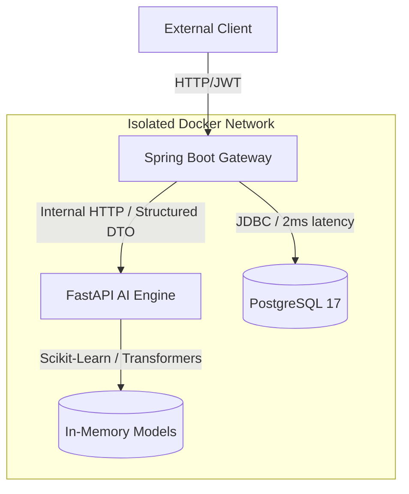

# Micro-Servicie-
This is a microservice agent designed for enterprise-level and banking transaction fraud detection; it comes equipped with basic cybersecurity systems and is fully optimized, operating via an integrated AI agent.
# Resilient AI-Driven Transaction Processing & Sentiment Analysis Engine

A highly optimized, production-ready distributed architecture featuring a robust **Spring Boot (Java 17/21)** backend acting as an API Gateway and enterprise firewall, coupled with a high-performance **FastAPI (Python)** microservice dedicated to real-time Machine Learning inference.

## 🏗️ Architectural Overview & Topology

The system is fully containerized using **Docker** and operates within an isolated virtual network. For defensive security compliance, only the Java Gateway is exposed to the host system.

1. **Enterprise Gateway (Spring Boot):** Handles TLS termination, stateless JWT authentication, stateless validation, and rate-limiting. It serves as a defensive shield, dropping corrupted or invalid payloads (`400 Bad Request`) at the perimeter to conserve downstream compute resources.
2. **AI Inference Mesh (FastAPI):** A specialized service running parallel predictive models (Fraud Detection and Sentiment Analysis). Models are loaded into memory eagerly at startup (*Warm-up pattern*) to eliminate cold-start latencies.
3. **Data Layer (PostgreSQL 17):** State persistence utilizes named Docker volumes, ensuring absolute data durability across container lifecycles.



## ⚡ Core Design Decisions & Engineering Rigor

### 1. Resiliency & Failure Transience (Circuit Breaking)
To prevent cascading failures, the Java gateway implements an advanced **Circuit Breaker** pattern (via Resilience4j). 
* **Saturation vs. Outage Isolation:** Local thread saturation triggers immediate `SERVICE_SATURATED` throttles without tripping the circuit breaker unnecessarily. 
* **Fail-Safe Mechanism:** When a true downstream AI outage occurs, the gateway handles exceptions gracefully, shifting the system state to `OPEN`. Transactions are permitted to pass under a degraded state.
* **Non-Speculative Data Integrity:** Under an outage condition, the system explicitly leaves the classification fields blank (`null`) rather than assuming a default `false` fraud value. Speculative backfilling with unseen model versions is restricted to preserve historical auditing consistency.

### 2. Defensive Perimeter & Offensive Security
* **Data-Leak Prevention via 404 Obfuscation:** Ownership validation checks enforce strict authorization boundaries. Unauthorized requests targeting alien resources return a `404 Not Found` instead of a `403 Forbidden` to actively prevent malicious endpoint enumeration.
* **Zero-Trust Contract Enforcement:** Contracts are strictly typed and verified at both perimeters. Java enforces immutability via `records`, while Python guarantees type safety using `Pydantic` schemas, treating the internal network as untrusted.

### 3. Statistical Threshold Optimization & Cross-Validation
The Fraud Detection model (built with 37 features) was rigorously evaluated using **5-Fold Cross-Validation** over a highly imbalanced dataset. 
* The decision threshold was analytically locked at **0.30** after performing a comprehensive financial loss-function mapping. 
* Finer optimizations (e.g., shifting to 0.35) were proven to be purely statistical noise given the data boundary limitations (98 active test fraud cases). The trade-offs were locked down based on mathematical error bounds rather than arbitrary guessing.

## 📊 Comprehensive Test Coverage (119 Verified Tests)

The system enforces strict regression testing policies through a comprehensive automated suite:

* **Java backend: 87/87 Passing Tests** (Including full End-to-End integration tests against a live database instance, JWT security boundary validation, and isolated infrastructure crash simulations).
* **Python AI Engine: 32/32 Passing Tests** (Validating internal API contracts, memory-caching structures, and transformer tokenization sanity checks).

```bash
# Test Execution Summary
TOTAL JAVA TESTS:   87/87 [BUILD SUCCESS]
TOTAL PYTHON TESTS: 32/32 [OK]
SYSTEM STATUS:      100% HEALTHY (api-java, ia-python, postgres)
```

## 🚀 Key Technologies Used
* **Backend:** Java, Spring Boot, Spring Security (JWT), Resilience4j.
* **AI/Data Science:** Python, FastAPI, Pydantic, Scikit-Learn, Hugging Face Transformers.
* **Infrastructure:** Docker, Docker Compose, PostgreSQL 17.
